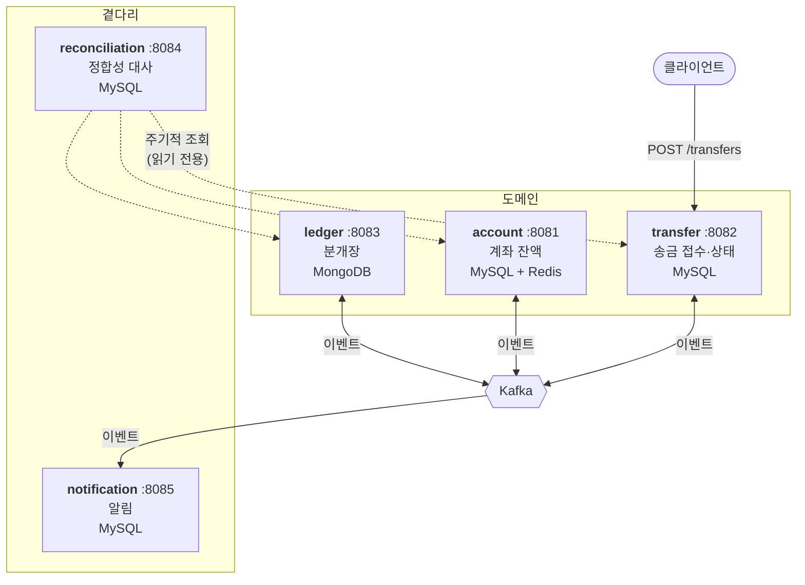
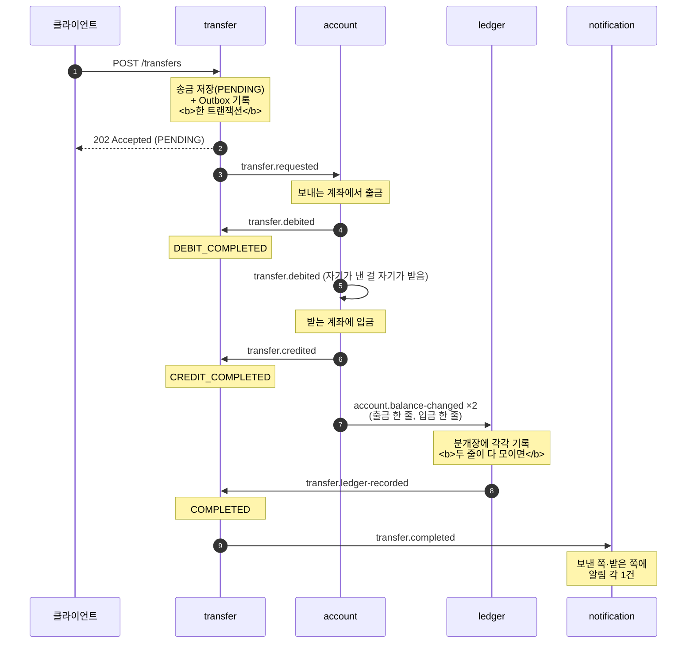
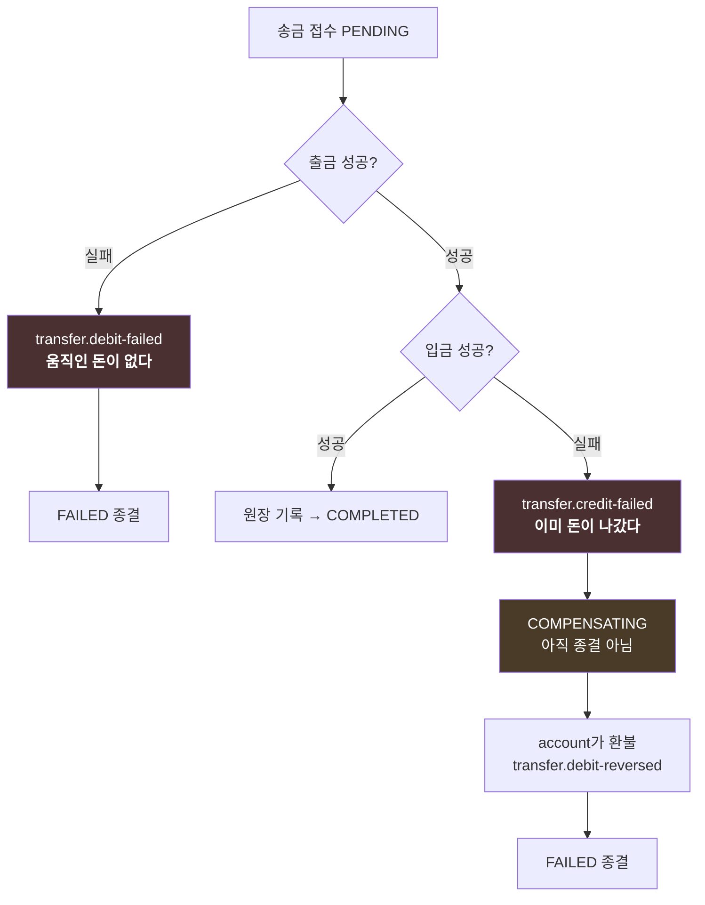

# 아키텍처 — 구조와 흐름

이 문서는 **시스템이 어떻게 생겼고 요청 하나가 어떤 길로 흐르는지**를 설명합니다.
(무엇을 왜 했는지의 기록은 `PROGRESS.md`, 앞으로 할 일은 `ROADMAP.md`에 있습니다.)

> **먼저 알아둘 것 둘.**
>
> **(1) 여기 적힌 구조가 최종형이 아닙니다.** 이 저장소는 패턴을 손으로 만들어 이해한 뒤
> 현업 기술로 갈아탑니다. 분산 락·Outbox 릴레이·Saga가 자체 구현인 건 의도된 중간 단계이고,
> 무엇을 무엇으로 바꿀 예정인지는 `DECISIONS.md`에 있습니다.
>
> **(2)** 이 시스템에는 **송금 전체를 지휘하는 코드가 없습니다.**
> 각 서비스가 "내가 할 일이 생겼다"는 이벤트를 보고 자기 몫만 하고 다음 이벤트를 냅니다.
> 그래서 흐름을 따라가려면 **코드가 아니라 이벤트를 따라가야** 합니다. 이 문서가 그 지도입니다.

---

## 1. 서비스 지도



| 서비스 | 포트 | 하는 일 | 스택 | 저장소 |
|---|---|---|---|---|
| `account-service` | 8081 | 계좌와 **잔액**. 돈을 실제로 움직이는 유일한 곳 | Spring MVC + JPA | MySQL `account_db` |
| `transfer-service` | 8082 | 송금 **접수**와 **상태 추적** | Spring MVC + JPA | MySQL `transfer_db` |
| `ledger-service` | 8083 | 모든 잔액 변경의 **분개장** | Spring WebFlux | MongoDB `ledger_db` |
| `reconciliation-service` | 8084 | 세 저장소를 **대조**해 어긋난 것 찾기 | Spring MVC + JPA | MySQL `reconciliation_db` |
| `notification-service` | 8085 | 송금 종결을 **알림**으로 | Spring MVC + JPA | MySQL `notification_db` |
| `gateway` | 8080 | *(Phase 4에서 구현)* | — | — |
| `config-server` | 8888 | *(Phase 4에서 구현)* | — | — |

**서비스끼리 동기 호출을 하지 않습니다.** 유일한 예외가 `reconciliation`인데, 그건 흐름에
끼어드는 게 아니라 **밖에서 들여다보기만** 하는 역할이라 그렇습니다.

### 왜 이렇게 나눴나

| 경계 | 이유 |
|---|---|
| account ↔ transfer | **돈을 움직이는 곳은 한 군데여야** 합니다. transfer는 "얼마를 어디로"만 알고, 잔액은 손대지 못합니다 |
| ledger를 따로 | 조회 트래픽이 압도적으로 몰리는 곳입니다. WebFlux + MongoDB로 읽기에 맞춰 뒀습니다 |
| reconciliation을 따로 | 세 저장소를 **가로질러** 봐야 합니다. 어느 한 서비스에 넣으면 그 서비스가 남의 데이터를 들여다보게 됩니다 |
| notification을 따로 | 알림이 송금을 막으면 안 됩니다. 통째로 죽어도 송금은 정상 완료됩니다 |

> **공유 라이브러리를 두지 않습니다.** 이벤트 DTO가 서비스마다 중복 정의되어 있는 건 실수가
> 아니라 선택입니다. 대신 **필드를 바꿀 때는 그 이벤트를 쓰는 모든 서비스를 함께** 고쳐야 합니다.

---

## 2. 송금 한 건이 흐르는 길 (정상)

### 먼저 큰 그림

```
① 접수     클라이언트 → transfer        "받았다" (아직 아무 돈도 안 움직임)
② 출금     account                      보내는 계좌에서 뺀다
③ 입금     account                      받는 계좌에 넣는다
④ 기록     ledger                       두 줄을 분개장에 적는다
⑤ 종결     transfer                     COMPLETED
⑥ 알림     notification                 양쪽에 알린다
```

**핵심은 ①이 곧바로 끝난다는 것입니다.** 클라이언트는 `202 Accepted`와 함께
상태 `PENDING`인 송금을 받습니다. **응답을 받았다고 송금이 된 게 아닙니다.**

### 이벤트로 보면



### 자주 헷갈리는 지점 셋

**(가) `transfer.debited`를 account가 자기도 받습니다.**
출금을 끝낸 account가 `transfer.debited`를 내고, **그걸 다시 자기가 받아** 입금을 합니다.
한 서비스 안에서 이어서 하면 될 일을 굳이 브로커에 한 바퀴 돌리는 이유는 **재시도**입니다 —
출금 스레드에서 곧바로 입금하다 실패하면 아무도 다시 해주지 않습니다.

**(나) 원장은 `transfer.credited`를 듣지 않습니다.**
원장이 듣는 건 `account.balance-changed` 하나뿐입니다. 송금이든 입출금 API든 보상 환불이든,
**잔액이 움직인 사실 하나가 원장 한 줄**이 됩니다. (자세한 이유는 §5)

**(다) 입금이 끝나도 아직 `COMPLETED`가 아닙니다.**
`transfer.ledger-recorded`가 와야 완료입니다. 입금 시점에 완료로 찍으면
"송금은 성공인데 원장에는 없는" 상태가 생기고, 그건 나중에 찾아내기가 훨씬 어렵습니다.

---

## 3. 어긋났을 때 — 두 갈래

**어디까지 갔느냐에 따라 되돌릴 게 있고 없고가 갈립니다.**



| | 출금 실패 | 입금 실패 |
|---|---|---|
| 돈이 움직였나 | 아니오 | **예 — 보내는 쪽에서 이미 나갔다** |
| 해야 할 일 | 종결만 | **환불(보상)** 후 종결 |
| 중간 상태 | 없음 | `COMPENSATING` |

### 보상은 왜 브로커를 한 바퀴 도나

입금이 실패하면 account가 `transfer.credit-failed`를 **발행하고 자기가 다시 받아** 환불합니다.
(가)와 같은 이유입니다 — 요청 스레드에서 바로 환불하면 **그 환불이 실패했을 때 아무도 다시
해주지 않습니다.** 브로커를 거치면 실패해도 재배달됩니다.

### 전진 단계와 보상 단계는 실패했을 때 처신이 다릅니다

| | 전진 단계 (출금·입금) | 보상 단계 (환불) |
|---|---|---|
| 실패하면 | **실패 이벤트를 남기고 물러난다** | **예외를 그대로 던진다** |
| 왜 | 흐름을 실패로 꺾으면 된다 | **물러날 곳이 없다.** 재배달로 계속 시도하고, 끝내 안 되면 DLT |

---

## 4. 이걸 지탱하는 장치 넷

흐름 자체보다 이 넷이 이 프로젝트의 본론입니다.

### ① 멱등성 키 — 같은 요청을 두 번 받아도 송금은 하나

클라이언트가 `Idempotency-Key` 헤더를 보냅니다. 같은 키로 다시 오면 **새 송금을 만들지 않고
최초 송금을 그대로 돌려줍니다.**

접수는 세 번의 커밋입니다. 중간에 죽으면 키가 `IN_PROGRESS`로 남는데,
**어디서 죽었느냐에 따라 처신이 정반대**입니다.

```
① 키 선점  →  ② 송금 저장  →  ③ 키에 결과 기록
        ↑                  ↑
   여기서 죽으면        여기서 죽으면
   송금이 없다          송금이 있다
   → 키를 풀어줘도 됨   → 풀면 두 번째 송금이 생긴다
```

`transfers.idempotency_key`가 이 둘을 가르는 근거입니다. **②와 같은 트랜잭션**에 들어가므로
송금이 있으면 키도 반드시 적혀 있습니다.

| 상황 | 처신 |
|---|---|
| 그 키로 커밋된 송금이 **있다** | 키를 마저 닫고 그 송금을 돌려준다 (전진 복구) |
| 송금이 없고 키가 **오래됐다** | 키를 놓아주고 새로 접수한다 |
| 송금이 없고 키가 **방금 것이다** | **409.** 지금 다른 스레드가 접수 중일 수 있다 |

> ⚠️ 세 번째를 두 번째와 섞으면 **살아 있는 접수의 키를 뺏어** 같은 키로 두 건이 접수됩니다.

### ② 분산 락 — 한 계좌의 잔액은 한 번에 하나씩

Redis `SET NX PX` + Lua로 계좌 단위 락을 겁니다. 그 위에 **낙관적 락(`@Version`)**을 한 겹 더 둡니다.

```
분산 락   정상 경로를 직렬화해서 애초에 충돌이 안 생기게
   +
낙관적 락  락이 TTL로 풀렸거나 Redis가 죽어 우회된 경우를 잡는 최후 안전망
```

**잔액을 바꾸는 모든 경로가 이 문을 지납니다.** REST 입출금 API도, Kafka로 들어온 Saga 단계도
`AccountService.guarded()`를 거칩니다 — 한쪽에만 있으면 없는 것과 같습니다.

### ③ Outbox — DB 커밋과 이벤트 발행을 하나로

"DB에 저장"과 "Kafka로 발행"은 서로 다른 시스템이라 한 트랜잭션으로 못 묶습니다.

```
❌ 저장만 되고 발행 실패 → 이벤트 유실
❌ 발행만 되고 저장 롤백 → 있지도 않은 일이 알려짐
```

그래서 **발행하는 대신 같은 트랜잭션 안에서 `outbox_events` 테이블에 INSERT**합니다.
별도 릴레이(`OutboxRelay`)가 그 테이블을 폴링해 Kafka로 보내고 `publishedAt`을 찍습니다.

발행 후 마킹 직전에 죽으면 같은 이벤트가 두 번 나갑니다 — **at-least-once**입니다.
중복은 받는 쪽이 감당합니다(§6).

### ④ 상태 진행도 — 뒤바뀐 순서를 견딘다

Saga 단계마다 **토픽이 다르고**, 토픽마다 **리스너 스레드가 다릅니다.**
그래서 `transfer.credited`가 `transfer.debited`보다 먼저 도착할 수 있습니다.

`TransferStatus`에 진행도를 매겨 **앞으로만** 가게 합니다.

```
PENDING → DEBIT_COMPLETED → CREDIT_COMPLETED → COMPLETED
                                                FAILED     (종결: 무엇이 와도 안 바뀜)
```

- 지나간 단계가 오면 → 진행도가 뒤라 **무시**
- 뒤 단계가 먼저 오면 → **건너뛰어서라도 적용**. 버리면 그 이벤트는 다시 오지 않아 송금이 영원히 멈춥니다

리스너 스레드가 여럿이라 **같은 송금 행을 동시에 건드릴 수 있습니다.** `Transfer`의 `@Version`이
그걸 막고, 충돌하면 **다시 읽어 전이 조건을 처음부터 판단**합니다 — 그 사이 바뀐 상태를 반영한
결정을 내려야 하기 때문입니다.

> ⚠️ 재시도는 **트랜잭션 밖에서** 해야 하므로 전이 자체가 `TransferStateUpdater`라는 별도 빈에
> 있습니다. 같은 빈 안에서 부르면 `@Transactional` 프록시를 타지 않습니다.
> (account의 `guarded()` + `SagaStepExecutor`와 같은 구조입니다.)

---

## 5. 원장은 왜 "송금 내역"이 아니라 "분개장"인가

처음엔 원장이 송금만 기록했습니다. 그런데 **잔액이 움직이는 길은 여럿**입니다.

| 잔액이 움직이는 경로 | 예전 원장에 남았나 |
|---|---|
| 송금 출금·입금 | ✅ |
| 입출금 API (`/internal/accounts/{id}/credit`·`debit`) | ❌ |
| 보상 환불 | ❌ |

그러면 **"원장 합 = 계좌 잔액"이 애초에 성립하지 않아** 정합성 대사를 할 수가 없습니다.

그래서 `account.balance-changed`라는 이벤트를 만들고, **잔액을 바꾸는 모든 경로가
`BalanceJournal`을 지나게** 했습니다. 원장은 그것만 보고 한 줄씩 적습니다.

```
전:  transfer.credited        ─▶ 원장이 송금 한 건을 두 줄로 기록
후:  account.balance-changed  ─▶ 원장이 잔액 변경 하나를 한 줄로 기록
```

> ⚠️ **한 경로라도 `BalanceJournal`을 빠뜨리면** 그 즉시 "원장 합 = 잔액"이 깨지고,
> 그 위에 세운 정합성 대사가 통째로 의미를 잃습니다.

### 분개 항목의 `reason`

| reason | 언제 |
|---|---|
| `TRANSFER_DEBIT` / `TRANSFER_CREDIT` | 송금 출금 / 입금 |
| `TRANSFER_REFUND` | 입금 실패로 되돌린 출금 (보상) |
| `DEPOSIT` / `WITHDRAWAL` | 송금과 무관한 입출금 API |
| `OPENING_BALANCE` | 원장 도입 이전 잔액을 한 줄로 이월 |

`OPENING_BALANCE`만 성격이 다릅니다 — **잔액을 움직이지 않습니다.** 원장이 없던 시절의
변경들을 뭉뚱그려 적어 지금 잔액과 원장 합을 맞추는 것입니다. 계좌당 한 번만 남습니다.

> ⚠️ `OPENING_BALANCE`는 **송금의 다리가 아닙니다.** `isTransferLeg()`에 넣으면 출금 줄 하나와
> 이월 줄 하나로 "두 줄 모였다"고 판단해 **입금 없이 원장 기록 완료를 알립니다.**

### 개시 이월은 어떻게 부르나

원장을 도입하기 전에 만들어진 계좌는 그때의 변경이 원장에 없어, 잔액이 멀쩡해도 계속
`BALANCE_MISMATCH`로 잡힙니다. **일회성 운영 작업**으로 한 줄을 심어 맞춥니다.

```
POST /internal/accounts/{id}/opening-balance   { observedBalance, ledgerBalance }
```

- **금액이 아니라 관측한 두 값을 받습니다.** 금액을 그대로 받으면 이 엔드포인트는
  *"남이 내 원장에 아무 숫자나 적을 수 있는 문"*이 됩니다. 차이는 계좌 서비스가 직접 뺍니다
- **대사 서비스가 자동으로 부르지 않습니다.** 부르는 순간 대사가 남의 데이터를 고치는 셈입니다.
  보고를 보고 판단해 부르는 건 운영자입니다
- 계좌당 한 번뿐입니다 (`accounts.opening_balance_carried_at`)

스냅샷 경합은 두 겹으로 막습니다.

| 검사 | 막는 것 |
|---|---|
| **잔액 CAS** (본 잔액 ≠ 지금 잔액이면 거절) | 읽은 뒤 잔액이 움직인 경우 |
| **미발행 분개 검사** (Outbox에 안 나간 게 있으면 거절) | 잔액은 그대로인데 **원장만 뒤처진** 경우 |

> ⚠️ 뒤엣것이 없으면 "잔액에는 반영됐지만 원장은 아직 모르는 변경"을 통과시켜 **같은 변경을
> 두 번 셉니다** — 이월분에 한 번, 뒤늦게 도착한 분개에 또 한 번.
> 그래도 *발행됐지만 아직 소비되지 않은* 이벤트는 못 막으니, **한산할 때 돌리고 다음 대사
> 회차로 확인**하세요. 잘못 심었으면 바로 다음 회차에 다시 잡힙니다.

---

## 6. 이벤트를 두 번 받으면 — 서비스마다 대응이 다릅니다

at-least-once이므로 같은 이벤트가 두 번 옵니다. **되돌릴 수 있느냐**에 따라 방법이 갈립니다.

| 서비스 | 방법 | 왜 |
|---|---|---|
| **account** | `processed_events`에 처리 흔적 (잔액 변경과 **같은 트랜잭션**) | 잔액 변경은 되돌릴 수 없다. 실패도 "처리했다"로 남긴다 — 안 그러면 재전송마다 실패 이벤트가 새로 나간다 |
| **transfer** | 상태 **진행도** (§4-④) | 지나간 단계는 무시, 종결 상태는 무엇이 와도 안 바뀜 |
| **ledger** | 문서 `_id`를 **발행하는 쪽이 고정한 `entryId`**로 | 재수신이 **같은 줄 덮어쓰기**가 된다. 중복 판별 테이블이 필요 없다 |
| **notification** | `(송금, 종류, 받는 사람)` unique + `PENDING`/`SENT` | **이미 나간 알림은 회수할 수 없다** |

### 알림이 특히 까다로운 이유

원장은 덮어쓰면 되고 잔액은 흔적으로 막을 수 있지만, **나간 알림은 못 되돌립니다.**
"10만원을 보냈습니다"가 두 번 가면 사용자는 두 번 나간 줄 압니다.

```
① 자리 잡기(PENDING)  →  ② 발송  →  ③ SENT로 표시
```

| 죽은 지점 | 재배달이 오면 |
|---|---|
| ①~② 사이 | PENDING을 보고 **다시 보낸다** ✅ |
| ②~③ 사이 | PENDING을 보고 **한 번 더 보낸다** ⚠️ 남는 창 |

②~③의 창은 발송과 기록을 원자적으로 못 묶는 이상 없앨 수 없습니다.
**드물게 두 번 가는 게 영영 안 가는 것보다 낫다**고 보고 이쪽을 택했습니다.

> ⚠️ ①에서 곧바로 `SENT`로 적으면 ①~② 사이에 죽었을 때 재배달이 "이미 보냈다"로 읽고
> 건너뜁니다. **알림이 조용히 사라지고 아무도 모릅니다.** 그래서 상태가 두 개 필요합니다.

> ⚠️ 기록(`NotificationRecorder`)과 발송(`NotificationService`)이 **다른 빈인 건 의도된 것**입니다.
> 같은 빈에서 부르면 `@Transactional` 프록시를 타지 않아 `markSent()`가 반영되지 않고,
> **상태가 영원히 PENDING으로 남아 재배달마다 알림이 다시 나갑니다.** 실제로 그렇게 만들었다가
> 테스트가 잡아냈습니다. (account-service의 `BalanceMutationExecutor`·`SagaStepExecutor`,
> transfer-service의 `TransferStateUpdater`도 모두 같은 이유로 갈라놓은 구조입니다.)

---

## 7. 컨슈머가 실패하면 — 재시도와 DLT

컨슈머를 가진 네 서비스가 `config/KafkaErrorHandlingConfig`에 **같은 정책을 각자** 정의합니다.

```
1초 → 2초 → 4초  최대 3회 재시도  →  안 되면 <원래 토픽>.DLT
```

결과가 달라질 리 없는 실패(JSON 파싱 실패, 보상 단계의 업무 예외)는 **재시도 없이 바로 DLT**입니다.

> ⚠️ **이 설정을 지우면** spring-kafka 기본값(지연 없이 10회 시도 후 **로그만 남기고 오프셋 커밋**)이
> 적용됩니다. 메시지가 조용히 사라집니다. 리스너를 새로 만들 때 이 설정이 적용되는지 확인하세요.

### 토픽 파티션은 쓰는 서비스가 모두 선언합니다

각 서비스의 `config/KafkaTopicsConfig`는 **발행하는 토픽뿐 아니라 소비하는 토픽과 DLT까지**
선언합니다(파티션 3, 복제 1).

컨슈머가 토픽이 만들어지기 전에 구독하면 **브로커가 1파티션으로 자동 생성**해버리고,
뒤늦게 3으로 늘려도 이미 붙은 컨슈머는 모릅니다(기본 `metadata.max.age.ms`가 5분).
서비스를 함께 띄운 e2e에서 **Saga 전체가 5분 멈추는 걸** 실제로 겪었습니다.

> ⚠️ 중복 선언은 안전하지만 **선언이 어긋나면 큰 쪽이 이깁니다.**
> 파티션 수를 바꿀 때는 그 토픽을 쓰는 서비스를 함께 확인하세요.

### 리스너에는 `id`를 줍니다 — 지표에 그 이름이 그대로 찍힙니다

```java
@KafkaListener(id = TransferEvents.DEBITED, topics = TransferEvents.DEBITED, ...)
```

`spring.kafka.listener` 지표의 `name` 라벨은 **컨테이너 빈 이름**입니다.
`id`를 주지 않으면 `org.springframework.kafka.KafkaListenerEndpointContainer#0-0`이 되어,
**어느 토픽이 느린지 화면에서 읽을 수 없습니다.** Kafka 클라이언트의 `client.id`도 같이 읽기 좋아집니다.

`groupId`를 함께 지정하므로 `id`가 컨슈머 그룹으로 쓰이지는 않습니다.

> ⚠️ **라벨을 바꾸면 시계열이 갈라집니다.** baseline(Phase 5 Step 3)을 잰 뒤에 이름을 바꾸면
> 이전 측정과 같은 잣대로 비교할 수 없습니다. 리스너를 새로 만들 때 `id`를 빼먹지 마세요
> (`MetricsExposureTest`가 지킵니다).

---

## 8. 뒤에서 도는 것들

### 정합성 대사 (reconciliation)

각 서비스가 옳게 동작해도 **합쳐놓고 보면 어긋날 수 있습니다.** Saga가 끊기거나 이벤트가
DLT로 빠지면 잔액과 원장이 벌어지고, 송금이 종결되지 못한 채 남습니다.
60초마다 세 서비스에 물어보고 찾아냅니다.

| 발견 유형 | 무엇 |
|---|---|
| `BALANCE_MISMATCH` | 계좌 잔액 ≠ 원장 합 |
| `UNSETTLED_TRANSFER` | 종결 안 된 채 오래된 송금 |
| `STRANDED_IDEMPOTENCY_KEY` | `IN_PROGRESS`로 남은 멱등성 키 |

**계좌 쪽을 기준으로** 훑습니다. 원장 기준으로 돌면 *"계좌는 있는데 원장이 통째로 빈"* 경우를
못 잡는데, 정작 그게 가장 흔한 사고입니다.

> ⚠️ **대사는 찾아서 알리기만 하고 고치지 않습니다.** 고치는 건 데이터 주인의 몫입니다 —
> 남의 서비스 데이터를 대사가 바꾸기 시작하면 서비스 경계가 무너지고, 원인을 모르는 채
> 증상만 지우게 됩니다. 그래서 각 서비스의 `/internal/reconciliation/*`는 **읽기 전용**입니다.

**발견 0건과 "대사가 못 돌았다"는 다릅니다.** 회차(`reconciliation_runs`)에 `failureReason`이
있으면 그 회차 결과를 믿으면 안 됩니다.

### 알림 (notification)

`transfer.completed` / `transfer.failed`만 듣습니다. 중간 단계는 듣지 않습니다 —
사용자에게 필요한 건 결과 하나지 "출금됐습니다 → 입금됐습니다"가 아닙니다.

| | 받는 사람 |
|---|---|
| 완료 | 보낸 쪽 + 받은 쪽 (**두 사람**) |
| 실패 | 보낸 쪽 **만** — 받는 쪽에 알리면 있지도 않았던 거래를 알려주는 꼴 |

**Saga에 끼어들지 않습니다.** 아무 이벤트도 발행하지 않으므로 통째로 죽어도 송금은 완료됩니다.

---

## 9. 토픽 한눈에

| 토픽 | 발행 | 소비 | 파티션 키 |
|---|---|---|---|
| `transfer.requested` | transfer | account | transferId |
| `transfer.debited` | account | **account**(입금), transfer | transferId |
| `transfer.credited` | account | transfer | transferId |
| `account.balance-changed` | account | ledger | **accountId** |
| `transfer.ledger-recorded` | ledger | transfer | transferId |
| `transfer.completed` | transfer | notification | transferId |
| `transfer.failed` | transfer | notification | transferId |
| `transfer.debit-failed` | account | transfer | transferId |
| `transfer.credit-failed` | account | **account**(환불), transfer | transferId |
| `transfer.debit-reversed` | account | transfer | transferId |

**파티션 키가 왜 둘로 갈리나:** Saga 이벤트는 **한 송금**의 단계들이 순서대로 처리되어야 하므로
`transferId`입니다. 분개 이벤트는 **한 계좌**의 잔액 변경이 순서대로 소비되어야 잔액 추이가
뒤섞이지 않으므로 `accountId`입니다. **목적이 다르면 키도 다릅니다.**

---

## 10. 흐름을 따라가야 할 때

이 방식의 대가는 **흐름 전체를 한눈에 볼 수 있는 코드가 없다**는 것입니다.
따라갈 때는 이 순서가 빠릅니다.

1. **토픽 이름으로 `grep`** — `grep -rn "transfer.debited" --include=*.java`
   발행하는 곳과 `@KafkaListener`가 같이 잡힙니다
2. **이벤트 계약**은 각 서비스의 `messaging/TransferEvents`·`messaging/AccountEvents`
3. **상태 전이 규칙**은 `transfer-service`의 `TransferStateUpdater`
4. **잔액 변경 경로**는 `account-service`의 `AccountService.guarded()`를 지나는 것들

| 궁금한 것 | 볼 곳 |
|---|---|
| 왜 이렇게 만들었나, 어떤 문제를 겪었나 | `PROGRESS.md` |
| **왜 이 기술을 골랐나, 무엇으로 갈아탈 예정인가** | `DECISIONS.md` |
| 앞으로 뭘 하나 | `ROADMAP.md` |
| 커밋·브랜치 규칙 | `CONTRIBUTING.md` |
| 작업할 때 지킬 것 | `../AGENTS.md` |
